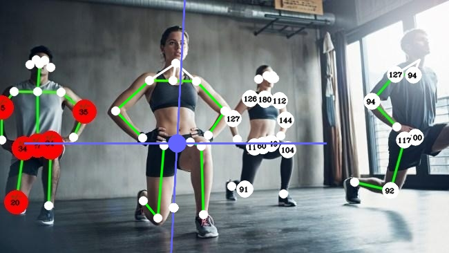

# Workout App

Workout app with pose estimation


### Requirements

Use ```pip install -r mpipe_requirements.txt``` to install all required packages

### App installation

```shell
git clone https://github.com/CyberMaryVer/workout-app.git
cd workout_web
```

### Examples of usage:

* test camera
```shell
python mp_workout.py --test
```

* workout **DUMBBELL LATERAL RAISE**
  - visualize with symmetry mode and full skeleton

```shell
python mp_workout.py --mode symmetry --skeleton 1 --config dumbbell_lateral_raise
```

* workout **DUMBBELL SHOULDER PRESS**
  - visualize with gravity-center mode without skeleton
```shell
python mp_workout.py --mode gravity-center --skeleton 0
```

* *by default* - workout **DUMBBELL SHOULDER PRESS**
  - visualize with headless skeleton
```shell
python mp_workout.py 
```
### Example of different visualization parameters:
1. ```--mode symmetry --skeleton 1```
   
2. ```--mode gravity_center --skeleton 2```

4. ```--mode angles --skeleton 0```

5. ```--mode angles --skeleton 2```



### Options
The program runs as a command-line script. Below you can see the list of available options. You can always go back to them using the --help flag.
```bash
  -h, --help            show this help message and exit
  
  # GENERAL PARAMETERS
  --repetitions         How many repetitions you want to do (by default 4)
  --weight              Your weight in kilograms (by default 55 kg)
  --config              Workout config (by default dumbbell_lateral_raise)
  --save_video          Save video file (result.mp4 - by default).
  
  # VISUALISATION SETTINGS
  --skeleton            If set to 0 shows only keypoints, 1 - default, 2 - headless.
  --mode                Mode: [gravity_center, angles, symmetry].
  
  # DEBUG OPTIONS
  --test                Test camera
```
