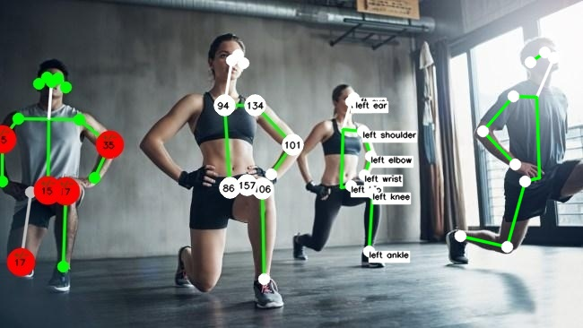
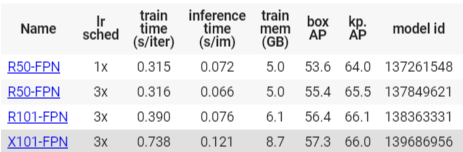

# pose.py

pose estimation with detectron2

Use ```pip install -r detectron-requirements.txt``` to install all required packages

Examples of usage:

* process video with mode angles and save result in result.mp4, save keypoints coordinates in csv file
```shell
python pose.py --video video.mp4 --mode angles --output --output_name result.mp4 --csv
```


* process video on cpu, use rcnn_R_50_FPN_3x, visualize with symmetry mode, process only each 15th frame for 100 frames

```shell
python pose.py --config-file 1 --device cpu --video video.mp4 --debug_video 15 100 --mode symmetry
```

* run program with webcam with keypoints_names mode
```shell
python pose.py --webcam --mode keypoints_names
```

* process image for second person on the image with angles mode, visualize only left side
```shell
python pose.py --image testimages/test.jpg --mode angles --side L --instance 1
```
### Example of different visualization parameters:
1. ```--mode symmetry```
   
2. ```--mode angles --side L```

3. ```--mode keypoints_names --side L```

4. ```--side R```



### Options
The program runs as a command-line script. Below you can see the list of available options. You can always go back to them using the --help flag.
```bash
  -h, --help            show this help message and exit
  
  # MODEL CONFIGURATION
  --config-file         Config file: [keypoint_rcnn_R_50_FPN_1x.yaml, keypoint_rcnn_R_50_FPN_3x.yaml, keypoint_rcnn_R_101_FPN_3x.yaml, keypoint_rcnn_X_101_32x8d_FPN_3x.yaml]
  --device              Type of inference: [cpu, cuda].
  --threshold           Threshold value.
  
  # INFERENCE PARAMETERS
  --webcam              Take inputs from webcam.
  --video               Path to video file.
  --image               Path to image file.
  --output              Set this parameter to save the output.
  --output_name         Output file name.
  --csv                 Save results to csv file.
  
  # VISUALISATION SETTINGS
  --test                Run test inference on image.
  --skeleton            If set to 0 shows only keypoints, 1 - default, 2 - headless.
  --joints              If set to 0 shows only connections, 1 - default.
  --side                If [L, R] is choosen, visualizes only one side.
  --mode                Mode: [keypoints_names, angles, symmetry].
  --instance            Number of instance for multiperson mode.
  --scale               Set scale parameter for video output.
  
  # DEBUG OPTIONS
  --verbose             Set verbose parameter.
  --debug_video         A list of space separated parameters
                        [step number_of_frames].

```

*Note: you can change config file, just set the number of model you want to use*

| Number | Model |
|:---:|:---|
|0|R50-FPN (default)|
|1|R50-FPN|
|2|R101-FPN|
|3|X101-FPN|



# mp_pose.py

pose estimation with mediapipe

Use ```pip install -r mpipe_requirements.txt``` to install all required packages

Examples of usage:

* process video with mode angles and save result in result.mp4, save keypoints coordinates in csv file
```shell
python mp_pose.py --video video.mp4 --mode angles --output --output_name result.mp4 --csv
```


* process video on cpu (automatically if there are no gpu), visualize with symmetry mode

```shell
python mp_pose.py --video video.mp4 --mode symmetry
```

* run program with webcam with keypoints_names mode
```shell
python mp_pose.py --webcam --mode keypoints_names
```

* process image with angles mode, visualize only left side
```shell
python mp_pose.py --image testimages/test.jpg --mode angles --side L
```
### Example of different visualization parameters:

* Same as with **pose.py**

### Options
The program runs as a command-line script. Below you can see the list of available options. You can always go back to them using the --help flag.
```bash
  -h, --help            show this help message and exit
  
  # MODEL CONFIGURATION
  --threshold           Threshold value.
  
  # INFERENCE PARAMETERS
  --webcam              Take inputs from webcam.
  --video               Path to video file.
  --image               Path to image file.
  --output              Set this parameter to save the output.
  --output_name         Output file name.
  --csv                 Save results to csv file.
  
  # VISUALISATION SETTINGS
  --test                Run test inference on image.
  --skeleton            If set to 0 shows only keypoints, 1 - default, 2 - headless.
  --joints              If set to 0 shows only connections, 1 - default.
  --side                If [L, R] is choosen, visualizes only one side.
  --mode                Mode: [keypoints_names, angles, symmetry].
  --instance            Number of instance for multiperson mode.
  --scale               Set scale parameter for video output.
  
  # DEBUG OPTIONS
  --verbose             Set verbose parameter.

```
